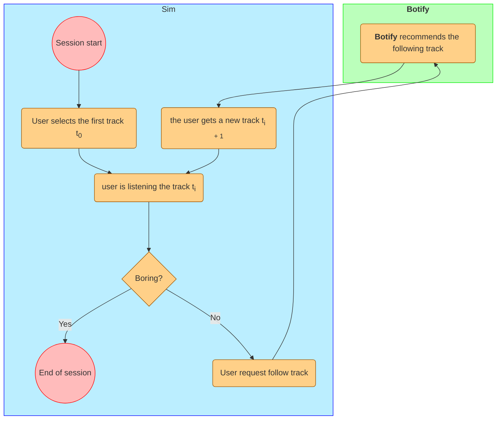

# Music recommender system

This project is based on a study course called Recommender Systems in Production.

The author of the original course repository is [Nikolay Anokhin](https://github.com/anokhin). With his permission I am publishing my fork of his private repository.

This solution ranked second among the students. At the same time I used only simple heuristics.

### General info

Users come to the **botify** music service to listen to music. First, the user picks the starting track himself. When the user has listened to that track, the service recommends the next one. The user can listen to the recommended track or skip it and move on to the next one. Otherwise, the user may get bored and leave. How the user will act depends on the quality of recommendations: if they are bad, the user will quickly leave; if they are good, he will "glue". The diagram below shows one user session

<center><b>User interaction with the Botify recommender</b></center>



The purpose of **botify** service is to keep the user as long as possible. The service measures the percentage of listening to each track from the session and sums these percentages to get the total length of the session (we ignore the fact that tracks can last different time - usually songs last about 3 minutes). The quality of recommendations directly affects how many tracks users will listen to and what percentage of them will listen to. Therefore, the quality of recommendations affects the length of the session and the success of the service as a whole.

### Modules description

#### botify

Recommendation service.

[Description and instructions](botify/README.md)

#### sim

Since our recommender is educational, it is not deployed for real users. But we want to experiment with the recommender as with a real one. For this purpose, a user simulator is implemented in the sim module. Running the simulator, we generate traffic similar to the traffic generated by real users.

[Description and instructions](sim/README.md)

#### Jupyter

Notebooks with data pre-processing for the simulator, visualization, AB experiments etc.

### Prerequisites

- Install docker
- Create virtualenv with python (it is recommended to use version 3.7)
- Not required, but you can use the ```report/requirements.txt``` to create an environment in the conda package manager (only if you prefer conda to pip).
- To use this project, follow the instructions in the readme files of the modules.

### General instructions

0. Fix paths for you OS (I use Win)
1. Run docker-container from botify module
2. Run manual or simulation mode with sim module
3. Save logs
4. Use "AB experiment" notebook to check performance if you're conducting new experiment.

### My contribution

* Translation how to READMEs from Russian and a pinch of mermaid.
* Modifications to the Bodify module (I did not touch the sim module)
    
    *Main ideas:*

    - Use a different model when quality is reduced.
    - Use filters for tracks and artists you've already listened to.

    *Details*

    - Use contextual model as a baseline
    - Use top pop if quality is reduced
    - Three experiments were conducted with different lengths of the top (1000, 100, 80). The best result was shown by the model using the data obtained from the Collaborative recommender and recommending only the first 100 tracks from the top.
    - Two filters were written using the listening history.
    - Implemented saving of tracks the user listened to redis.
    - The AB-experiments notebook has been edited for more easily obtaining results, and a cumulative sum over time plot has been added.
    - The TopPop model analysis notebook has been edited for easy comparison of TopPop models using different data.
    - Small refactoring was done to simplify the functionality of adding experiments.

All files in the Botify module have been changed or written from scratch.

### Results

The best time gain relative to the baseline was **63.003%**. This result was obtained using a filter on artists, where one artist could meet only once.

If you know Russian, you may check [the report](report/README.md) for a more detailed description of the result.

### Further work and ideas

- Another idea I would like to implement is to save a list of "suitable" tracks for the user based on the listening history and give out the most frequent tracks in this list.
- Improving network architecture  
- It is also worth adding logging to count the number of times TopPop is used
- Add other embeddings
