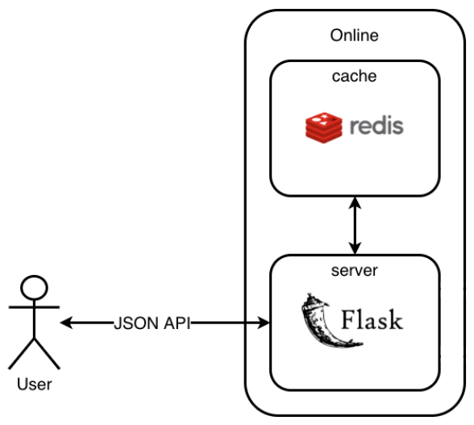

# Botify

The recommendation service is implemented as a [Flask](https://flask-restful.readthedocs.io/en/latest/) application.

This application is able to handle requests via REST API.

[Redis](https://redis.io/) is used as in-memory cache.

The application writes an event log in json in the `/app/log/` folder.



## Instruction manual

1. [Installing the docker](https://www.docker.com/products/docker-desktop)
1. Compiling images and running containers

   ```CLI
   docker-compose up -d --build 
   ```

1. Looking at the recommender logs

   ```CLI
   docker logs recommender-container
   ```

1. Stopping the containers

   ```CLI
   docker-compose stop
   ```

1. Modify the code in this module
1. Repeat steps 2-4 until you reach a good quality recommendation. 

## Useful Commands

Checking that the service is alive

```CLI
curl http://localhost:5000/
```

Requesting track information

```CLI
curl http://localhost:5000/track/42
```

Request the following track

```CLI
curl -H "Content-Type: application/json" -X POST -d '{"track":10,"time":0.3}'  http://localhost:5000/next/1
```

Ending a user session

```CLI
curl -H "Content-Type: application/json" -X POST -d '{"track":10,"time":0.3}'  http://localhost:5000/last/1
```

Downloading user session logs from the container

```CLI
docker cp recommender-container:/app/log/ /tmp/
```
