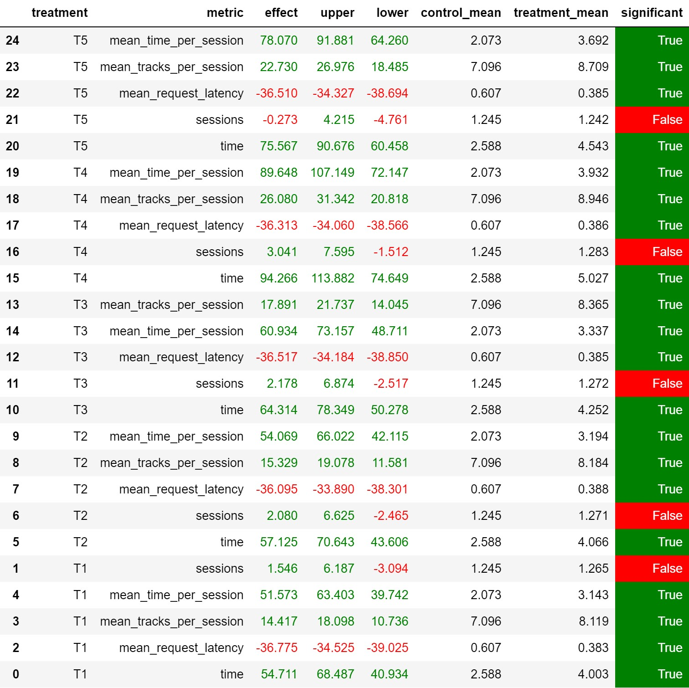
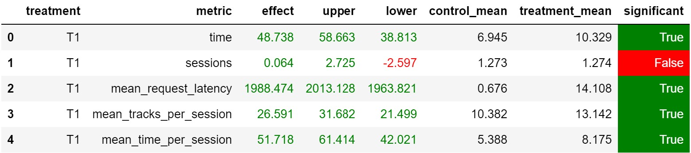

# Отчет

## Основные идеи

1. Использовать вторую по качеству модель при снижении качества.
2. Использовать фильтры для уже прослушанных треков/артистов.

## Детали

В качестве основной модели использовалась оригинальная модель нейросетевого рекоммендера.

1. В качестве второй по качеству модели выбран TopPop.
    1. Получен большой датасет с использованием эксперимента ```RECOMMENDERS``` ```data_60k.json```
    2. На основе этих данных реализован эксперимент ```TOP_POP_COMPARISON```. Было проведено три эксперимента с различной длинной топа (1000, 100, 80). Наилучший результат показала модель использующая данные полученные из Collaborative рекомендера и при этом рекомендовались только первые 100 треков из топа.

2. Было написано два фильтра использующих историю прослушивания.
    1. Реализовано сохранение прослушанных пользователем треков в redis.
    2. Реализован фильтр по истории треков.
    3. Реализован фильтр сочетающий историю треков и количество повторений артиста. Т.е. начиная с определенного числа треки определенного артиста перестанут рекомендоваться.
    4. При случае когда результат фильтрации пустой используется случайный рекомендер.

- Внесены правки в тетрадь первой недели для более удобного получения результата и добавлен график кумулятивной суммы по времени.

- Внесены правки в тетрадь второй недели для удобного сравнения моделей TopPop использующих различные данные.

## Результаты

Наилучший прирост относительно оригинального нейросетевого рекомендера по времени составил **63.003%**. Данный результат был получен с использованием фильтра по артистам при котором один артист мог встретиться только 1 раз. Наилучший результат при использовании фильтра по истории прослушивания показал результат в **60.955%**. При сравнении подходов с этими двумя фильтрами фильтр по авторам не показал увеличения метрики на А/B тесте (эксперимент 10).

Ниже приводятся основные визуализации результатов А/B экспериментов. Остальные графики можно найти в тетради первой недели.

### Результаты эксперимента ```TOP_POP_COMPARISON```

T1 TopPop на данных Random

T2 TopPop на данных StickyArtist

T3 TopPop на данных TopPop

T4 TopPop на данных Collaborative

T5 TopPop на данных Contextual

C Random

Эксперимент 1 топ 1000


Эксперимент 2 топ 100



Эксперимент 3 топ 80


### Результаты эксперимента ```CONTEXTUAL_COMPARISON```

T1 Contextual с TopPop и фильтром

C Contextual

Эксперимент 1 SIMPLE_HISTORY 0.80


Эксперимент 2 SIMPLE_HISTORY 0.75


Эксперимент 3 SIMPLE_HISTORY 0.7


Эксперимент 4 SIMPLE_HISTORY 0.65


Эксперимент 5 SIMPLE_HISTORY 0.60


Эксперимент 6 SIMPLE_HISTORY 0.55


Эксперимент 7 AUTHOR_TRACK_HISTORY rec_tolerance = 0.65 artist_tolerance = 2


Эксперимент 8 AUTHOR_TRACK_HISTORY rec_tolerance = 0.65 artist_tolerance = 1


Эксперимент 9 AUTHOR_TRACK_HISTORY rec_tolerance = 0.65 artist_tolerance = 3



Эксперимент 10 AUTHOR_TRACK_HISTORY VS SIMPLE_HISTORY rec_tolerance = 0.65 artist_tolerance = 1


## Инструкция по запуску

Все нижеследующие действия производились в виртуальной среде анаконда.
requirements.txt находится в этой папке.

Инструкции по запуску (аналогичны оригинальным):

0. Изменить пути к файлам, где необходимо.
1. Запустить docker-контейнер.
2. Выполнить симуляции.
3. Сохранить результаты симуляции в файл.
4. Получить результаты эксперимента в ноутбуке первой недели.

## Идеи для дальнейших экспериментов

- Еще одной идеей которую хотелось бы реализовать является сохранение списка "подходящих" пользователю треков на основе истории прослушивания и выдаче наиболее часто встречающихся в этом списке треков. Так же стоит добавить логирование для подсчета количества случаев использования TopPop и допустим после некоторого порога рекомендовать наиболее встречающиеся из "подходящих". В целом неплохо было бы получить график среднего времени прослушивания от количества использования TopPop для всех случаев его использования для определения этого порога.

- Улучшение архитектуры сети  
